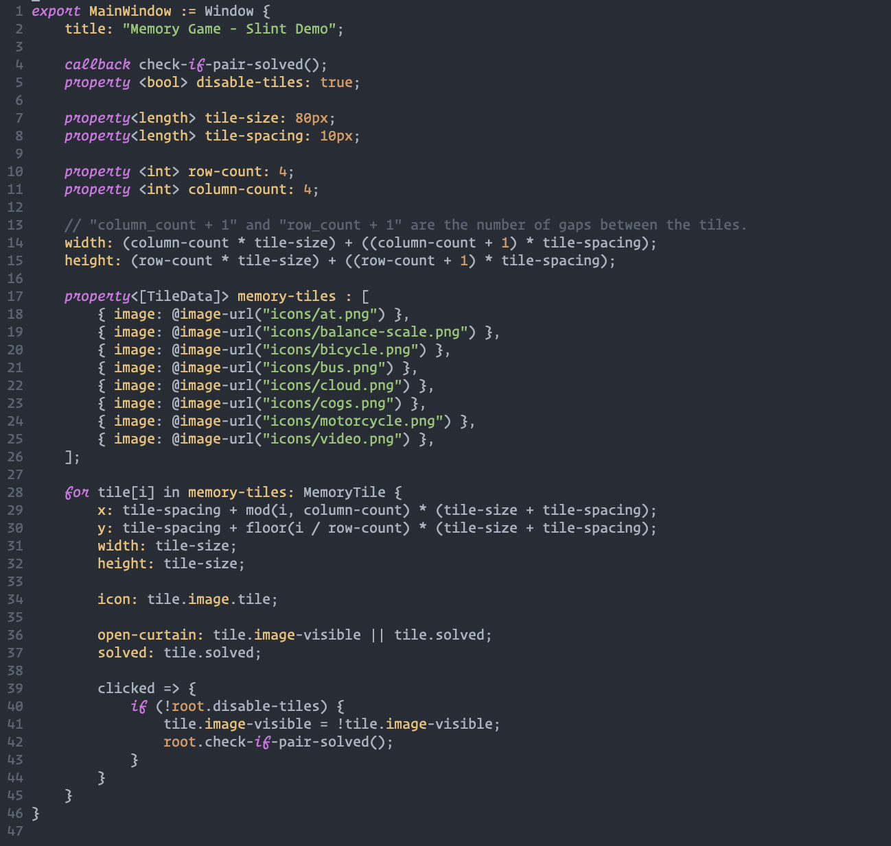
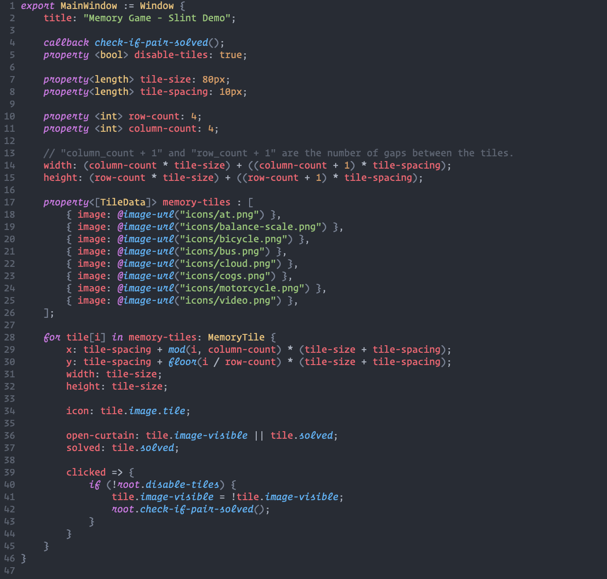
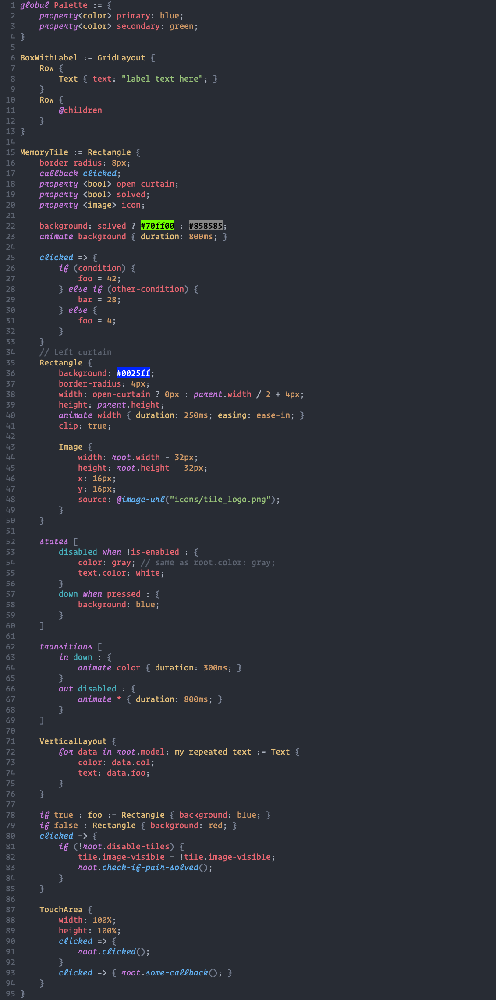

# tree-sitter-slint

## Status

Tree sitter grammar for slint targeted at neovim

This is still experimental, is missing a few features and is kind of bloated.
Issues and pull requests are very welcome. 

## Pictures

### Without Tree Sitter 

### With Tree Sitter 

## Installation

This isn't yet a part of the nvim-treesitter repository so it has to be
installed and configured manually.

Make sure you have `nvim-treesitter` installed and configured. Instructions are
[here](https://github.com/nvim-treesitter/nvim-treesitter)

`nvim-treesitter` has [advanced instructions](https://github.com/nvim-treesitter/nvim-treesitter#adding-parsers)
for manually adding a parser. 

For syntax highlighting the most important thing is to add the highlights.scm
file from this repo's queries folder to your nvim configs in your
`nvim/queries/slint` folder.

## Just for fun

To show off the highlighting and the language features here is this picture just for fun

